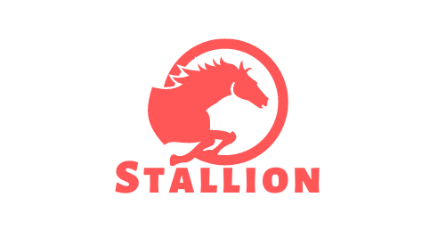

<p align="center">

</p>

<p align="center">

<br />


</p>

Fast message broker implemented with Golang programming language.<br />
Using no external libraries, just internal Golang libraries.

## How to use?
Get package:
```shell
go get github.com/amirhnajafiz/stallion@latest
```

Now to set the client up you need to create a **stallion** server.<br />
Stallion server is the message broker server.

### Create server in Golang
```go
package main

import "github.com/amirhnajafiz/stallion"

func main() {
	if err := stallion.NewServer(":9090"); err != nil {
		panic(err)
	}
}
```

### Create a server with docker
Check the docker [documentation](./docker/README.md) for stallion server.

### Creating Clients
You can connect to stallion server like the example below:
```go
package main

import (
	"fmt"
	"time"

	"github.com/amirhnajafiz/stallion"
)

func main() {
	client, err := stallion.NewClient("localhost:9090")
	if err != nil {
		panic(err)
	}
}
```

### Subscribe on a topic
```go
client.Subscribe("topic", func(data []byte) {
    // any handler that you want
    fmt.Println(string(data))
})
```

### Publish over a topic
```go
client.Publish("topic", []byte("Hello"))
```

### Unsubscribe from a topic
```go
client.Unsubscribe("topic")
```

